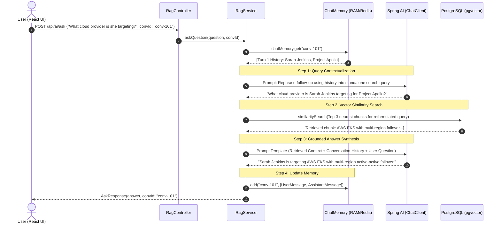

# 🧠 Master Guide: Multi-Turn Conversational RAG in Spring AI & React

An architectural deep dive and implementation guide explaining how **Multi-Turn Retrieval-Augmented Generation (RAG)** was designed and implemented using **Java 21**, **Spring Boot**, **Spring AI 2.0**, **PostgreSQL (pgvector)**, and **React**.

---

## 📑 Table of Contents

1. [The Fundamental Problem with Single-Turn RAG](#1-the-fundamental-problem-with-single-turn-rag)
2. [High-Level Architecture & Pipeline](#2-high-level-architecture--pipeline)
3. [The 4-Step Multi-Turn Workflow](#3-the-4-step-multi-turn-workflow)
4. [Backend Code Deep Dive](#4-backend-code-deep-dive)
   - [A. ChatMemory Configuration (`ChatMemoryConfig.java`)](#a-chatmemory-configuration-chatmemoryconfigjava)
   - [B. Data Contracts (`AskRequest.java` & `AskResponse.java`)](#b-data-contracts-askrequestjava--askresponsejava)
   - [C. REST Controller (`RagController.java`)](#c-rest-controller-ragcontrollerjava)
   - [D. Core Engine (`RagService.java`)](#d-core-engine-ragservicejava)
5. [Frontend Integration (`RagAssistant.jsx` & `api.js`)](#5-frontend-integration-ragassistantjsx--apijs)
6. [Step-by-Step Testing & Verification](#6-step-by-step-testing--verification)
7. [Enterprise Production Patterns & Scaling](#7-enterprise-production-patterns--scaling)

---

## 1. The Fundamental Problem with Single-Turn RAG

In standard single-turn RAG, each API call is completely stateless. While this works fine for isolated questions, it completely collapses during realistic human conversation:

### The "Pronoun Ambiguity" Failure Scenario

Suppose the user uploaded a document containing:
> *"Project Apollo is our internal cloud migration initiative scheduled for Q4 2026. The lead engineer is Sarah Jenkins, and the migration targets AWS EKS."*

- **Turn 1**: 
  - **User**: *"Who is leading Project Apollo and when is it scheduled?"*
  - **RAG Result**: *"Project Apollo is scheduled for Q4 2026, and the lead engineer is Sarah Jenkins."* ✅

- **Turn 2 (Follow-up)**:
  - **User**: *"What cloud provider is she targeting?"*
  - **Single-Turn Vector Search**: Looks for chunks closest to:
    $$\text{"What cloud provider is she targeting?"}$$
  - **Failure**: Neither *"Project Apollo"* nor *"Sarah Jenkins"* appears in this question. The vector search computes cosine distance against pronouns (*"she"*, *"it"*), matches irrelevant chunks, and the LLM responds:
    $$\text{"I don't have enough information in my knowledge base to answer that."} \quad ❌$$

---

## 2. High-Level Architecture & Pipeline

Multi-Turn RAG solves this problem by introducing **Session State (ChatMemory)** and **Query Contextualization (Query Reformulation)**:



---

## 3. The 4-Step Multi-Turn Workflow

| Step | Component | Responsibility |
|---|---|---|
| **1. Query Reformulation** | `ChatClient` | Reads conversation history and reformulates ambiguous follow-up questions into self-contained search queries containing explicit entities. |
| **2. Similarity Search** | `PgVectorStore` | Queries high-dimensional vector embeddings using Cosine Distance against the reformulated query to find the Top-3 most relevant document chunks. |
| **3. Grounded Synthesis** | `ChatClient` | Feeds retrieved context chunks, conversation history, and user question into an instruction template with strict grounding rules to eliminate hallucinations. |
| **4. Memory Update** | `ChatMemory` | Appends user question and model answer to the session's sliding memory window. |

---

## 4. Backend Code Deep Dive

### A. ChatMemory Configuration (`ChatMemoryConfig.java`)

Located at: [`src/main/java/dev/uday/aijavadevs/config/ChatMemoryConfig.java`](file:///e:/JAVA/aijavadevs/src/main/java/dev/uday/aijavadevs/config/ChatMemoryConfig.java)

```java
package dev.uday.aijavadevs.config;

import org.springframework.ai.chat.memory.ChatMemory;
import org.springframework.ai.chat.memory.InMemoryChatMemoryRepository;
import org.springframework.ai.chat.memory.MessageWindowChatMemory;
import org.springframework.context.annotation.Bean;
import org.springframework.context.annotation.Configuration;

@Configuration
public class ChatMemoryConfig {

    @Bean
    public ChatMemory chatMemory() {
        return MessageWindowChatMemory.builder()
                .chatMemoryRepository(new InMemoryChatMemoryRepository())
                .maxMessages(20)
                .build();
    }
}
```

#### Key Architectural Decisions:
1. **`MessageWindowChatMemory`**: Maintains a **rolling window** of the last $N$ messages (set to 20). If a conversation reaches 50+ messages, older messages are pruned to prevent exceeding LLM context token windows and accumulating runaway API costs.
2. **`InMemoryChatMemoryRepository`**: Thread-safe in-memory store keyed by `conversationId`. In enterprise production, this can be swapped with Redis or PostgreSQL (`JdbcChatMemoryRepository`) without altering any business logic.

---

### B. Data Contracts (`AskRequest.java` & `AskResponse.java`)

Located at:
- [`src/main/java/dev/uday/aijavadevs/rag/AskRequest.java`](file:///e:/JAVA/aijavadevs/src/main/java/dev/uday/aijavadevs/rag/AskRequest.java)
- [`src/main/java/dev/uday/aijavadevs/rag/AskResponse.java`](file:///e:/JAVA/aijavadevs/src/main/java/dev/uday/aijavadevs/rag/AskResponse.java)

```java
public record AskRequest(String question, String conversationId) {
    // Overloaded constructor for backwards compatibility
    public AskRequest(String question) {
        this(question, null);
    }
}
```

```java
public record AskResponse(String answer, String conversationId) {
    public AskResponse(String answer) {
        this(answer, null);
    }
}
```

#### Why Records?
Java 21 records provide immutable, thread-safe data carriers with built-in getters, `equals()`, `hashCode()`, and `toString()`. The secondary constructors ensure single-turn cURL scripts and unit tests continue to work without modification.

---

### C. REST Controller (`RagController.java`)

Located at: [`src/main/java/dev/uday/aijavadevs/rag/RagController.java`](file:///e:/JAVA/aijavadevs/src/main/java/dev/uday/aijavadevs/rag/RagController.java)

```java
package dev.uday.aijavadevs.rag;

import org.springframework.web.bind.annotation.*;

@RestController
@RequestMapping("/api/ai")
public class RagController {

    private final RagService ragService;

    public RagController(RagService ragService) {
        this.ragService = ragService;
    }

    @PostMapping("/ask")
    public AskResponse ask(@RequestBody AskRequest request) {
        return ragService.askQuestion(request.question(), request.conversationId());
    }

    @DeleteMapping("/ask/{conversationId}")
    public void clearConversation(@PathVariable String conversationId) {
        ragService.clearConversation(conversationId);
    }
}
```

- **`POST /api/ai/ask`**: Accepts question and optional `conversationId`.
- **`DELETE /api/ai/ask/{conversationId}`**: Enables the client to wipe server-side chat memory when starting a new session.

---

### D. Core Engine (`RagService.java`)

Located at: [`src/main/java/dev/uday/aijavadevs/rag/RagService.java`](file:///e:/JAVA/aijavadevs/src/main/java/dev/uday/aijavadevs/rag/RagService.java)

```java
package dev.uday.aijavadevs.rag;

import java.util.List;
import java.util.Map;
import java.util.UUID;
import java.util.stream.Collectors;

import org.springframework.ai.chat.client.ChatClient;
import org.springframework.ai.chat.memory.ChatMemory;
import org.springframework.ai.chat.messages.AssistantMessage;
import org.springframework.ai.chat.messages.Message;
import org.springframework.ai.chat.messages.UserMessage;
import org.springframework.ai.chat.prompt.Prompt;
import org.springframework.ai.chat.prompt.PromptTemplate;
import org.springframework.ai.document.Document;
import org.springframework.ai.vectorstore.SearchRequest;
import org.springframework.ai.vectorstore.VectorStore;
import org.springframework.stereotype.Service;

@Service
public class RagService {

    private final ChatClient chatClient;
    private final VectorStore vectorStore;
    private final ChatMemory chatMemory;

    public RagService(ChatClient.Builder chatClientBuilder, VectorStore vectorStore, ChatMemory chatMemory) {
        this.chatClient = chatClientBuilder.build();
        this.vectorStore = vectorStore;
        this.chatMemory = chatMemory;
    }

    public AskResponse askQuestion(String question) {
        return askQuestion(question, null);
    }

    public AskResponse askQuestion(String question, String conversationId) {
        // Ensure conversationId exists
        String convId = (conversationId != null && !conversationId.isBlank())
                ? conversationId
                : UUID.randomUUID().toString();

        // 1. Fetch previous history for this session
        List<Message> history = chatMemory.get(convId);

        // 2. Query Contextualization: Rewrite follow-up into standalone query
        String searchQuery = contextualizeQuery(question, history);

        // 3. Similarity Search in pgvector using the standalone query
        List<Document> similarDocuments = vectorStore.similaritySearch(
                SearchRequest.builder()
                        .query(searchQuery)
                        .topK(3)
                        .build()
        );

        // 4. Combine retrieved text chunks
        String context = similarDocuments.stream()
                .map(Document::getText)
                .collect(Collectors.joining("\n\n"));

        String historyString = formatHistory(history);

        // 5. Instruction-tuned Prompt Template
        String templateString = """
                You are a knowledgeable assistant. Use the following retrieved CONTEXT and CONVERSATION HISTORY to answer the user's QUESTION.
                If the answer is not present in the CONTEXT or CONVERSATION HISTORY, respond honestly: "I don't have enough information in my knowledge base to answer that."
                Do not make up facts or extrapolate beyond the provided CONTEXT.

                CONTEXT:
                {context}

                CONVERSATION HISTORY:
                {history}

                QUESTION:
                {question}
                """;

        PromptTemplate promptTemplate = new PromptTemplate(templateString);
        Prompt prompt = promptTemplate.create(Map.of(
                "context", context.isBlank() ? "No relevant documents found." : context,
                "history", historyString.isBlank() ? "No previous history." : historyString,
                "question", question
        ));

        // 6. Generate grounded answer
        String answer = chatClient.prompt(prompt)
                .call()
                .content();

        // 7. Save turn into ChatMemory
        chatMemory.add(convId, List.of(new UserMessage(question), new AssistantMessage(answer)));

        return new AskResponse(answer, convId);
    }

    public void clearConversation(String conversationId) {
        if (conversationId != null && !conversationId.isBlank()) {
            chatMemory.clear(conversationId);
        }
    }

    private String contextualizeQuery(String question, List<Message> history) {
        if (history == null || history.isEmpty()) {
            return question; // First turn needs no rewriting
        }

        String historyString = formatHistory(history);

        String promptString = """
                Given the following chat history and a follow-up user question, rephrase the follow-up question into a standalone search query that contains all necessary subject names and context.
                Do NOT answer the question. Only output the standalone search query without preamble. If the question is already standalone, return it unchanged.

                Chat History:
                {history}

                Follow-up Question:
                {question}

                Standalone Search Query:
                """;

        PromptTemplate template = new PromptTemplate(promptString);
        Prompt prompt = template.create(Map.of(
                "history", historyString,
                "question", question
        ));

        try {
            String rewritten = chatClient.prompt(prompt).call().content();
            if (rewritten != null && !rewritten.isBlank()) {
                return rewritten.trim();
            }
        } catch (Exception e) {
            // Fallback gracefully to original question if LLM call fails
        }

        return question;
    }

    private String formatHistory(List<Message> history) {
        if (history == null || history.isEmpty()) {
            return "";
        }
        return history.stream()
                .map(m -> m.getMessageType() + ": " + m.getText())
                .collect(Collectors.joining("\n"));
    }
}
```

---

## 5. Frontend Integration (`RagAssistant.jsx` & `api.js`)

Located at:
- [`frontend/src/api.js`](file:///e:/JAVA/aijavadevs/frontend/src/api.js)
- [`frontend/src/components/RagAssistant.jsx`](file:///e:/JAVA/aijavadevs/frontend/src/components/RagAssistant.jsx)

### Frontend API Client
```javascript
export async function askQuestion(question, conversationId = null) {
  return request('/api/ai/ask', {
    method: 'POST',
    body: JSON.stringify({ question, conversationId }),
  });
}

export async function clearConversation(conversationId) {
  if (!conversationId) return;
  return request(`/api/ai/ask/${encodeURIComponent(conversationId)}`, {
    method: 'DELETE',
  });
}
```

### Key UI Features Built:
1. **Thread Tracking**: Displays `Thread: #a8f34b • Turn 2` with session status.
2. **New Chat Button**: Calls server-side `DELETE /api/ai/ask/{conversationId}` to free backend memory, generates a new client `conversationId`, and resets message state.
3. **Dynamic Suggested Chips**: Automatically flips from initial questions (*"Who is leading Project Apollo?"*) to follow-up questions (*"What cloud provider is targeted?"*) once the conversation starts.
4. **Multi-Stage Loading State**:
   - `Step 1/3`: *Contextualizing query with chat memory...*
   - `Step 2/3`: *Searching pgvector embeddings...*
   - `Step 3/3`: *Synthesizing grounded multi-turn answer...*

---

## 6. Step-by-Step Testing & Verification

### Step 1: Ingest Document
```bash
curl -X POST http://localhost:8081/api/ai/documents \
  -H "Content-Type: application/json" \
  -d '{
    "content": "Project Apollo is our internal cloud migration initiative scheduled for Q4 2026. The lead engineer is Sarah Jenkins, and the migration targets AWS EKS with multi-region failover."
  }'
```

### Step 2: Turn 1 (Initial Question)
```bash
curl -X POST http://localhost:8081/api/ai/ask \
  -H "Content-Type: application/json" \
  -d '{
    "question": "Who is leading Project Apollo and when is it scheduled?",
    "conversationId": "demo-session"
  }'
```
**Response:**
```json
{
  "answer": "Project Apollo is scheduled for Q4 2026, and the lead engineer is Sarah Jenkins.",
  "conversationId": "demo-session"
}
```

### Step 3: Turn 2 (Follow-up with pronouns)
```bash
curl -X POST http://localhost:8081/api/ai/ask \
  -H "Content-Type: application/json" \
  -d '{
    "question": "What cloud platform is she targeting?",
    "conversationId": "demo-session"
  }'
```
**Response:**
```json
{
  "answer": "Sarah Jenkins is targeting AWS EKS with multi-region active-active failover for Project Apollo.",
  "conversationId": "demo-session"
}
```

### Step 4: Clear Session Memory
```bash
curl -X DELETE http://localhost:8081/api/ai/ask/demo-session
```

---

## 7. Enterprise Production Patterns & Scaling

When deploying this system to high-scale production, consider these 3 enhancements:

1. **Persistent Chat Storage (Redis / PostgreSQL)**:
   - Currently, `InMemoryChatMemoryRepository` stores sessions in JVM heap memory.
   - For multi-instance horizontal scaling, replace it with Spring AI's Redis or JDBC repository so session state is shared across all pods behind your load balancer.
2. **Hybrid Search (Dense + Sparse)**:
   - Combine dense vector similarity (pgvector cosine distance) with PostgreSQL full-text search (tsvector) for exact keyword/part-number matching.
3. **Async Streaming (Server-Sent Events / SSE)**:
   - Switch from blocking `.call().content()` to `.stream().content()` for real-time word-by-word streaming to the frontend.

---

51930237

*Document created for Java-RAG AI Knowledge Assistant.*
