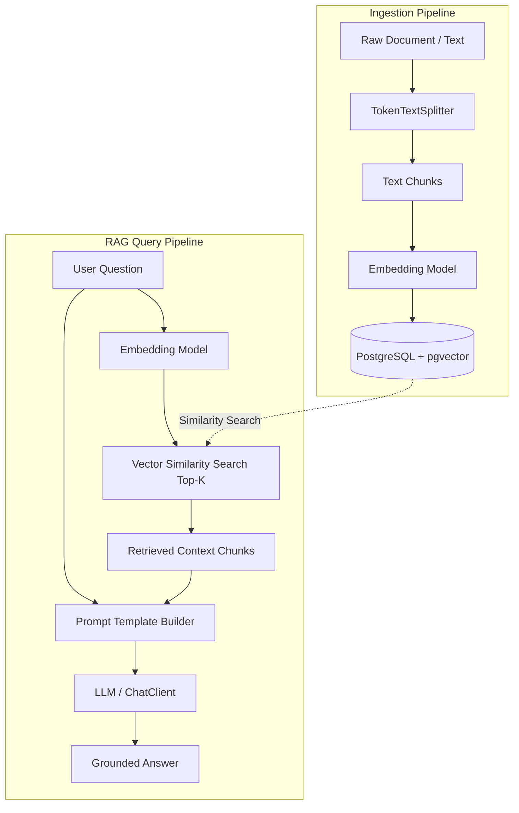

# 🧠 Java-RAG: AI Knowledge Assistant

[](https://adoptium.net/)
[](https://spring.io/projects/spring-boot)
[](https://spring.io/projects/spring-ai)
[](https://github.com/pgvector/pgvector)
[](https://www.docker.com/)

A enterprise-grade **Retrieval-Augmented Generation (RAG)** system and AI Knowledge Assistant built with **Java 21**, **Spring Boot**, and **Spring AI**, backed by **PostgreSQL & pgvector** for persistent vector storage and similarity search.

---

## 📑 Table of Contents

- [Overview & Architecture](#-overview--architecture)
- [Key Features](#-key-features)
- [Tech Stack](#-tech-stack)
- [Project Structure](#-project-structure)
- [Prerequisites](#-prerequisites)
- [Getting Started](#-getting-started)
- [API Reference & Examples](#-api-reference--examples)
  - [1. Ingest Knowledge Document](#1-ingest-knowledge-document)
  - [2. Ask Question via RAG](#2-ask-question-via-rag)
  - [3. General Chat](#3-general-chat)
  - [4. Summarize Text (Structured Output)](#4-summarize-text-structured-output)
- [Postman Testing](#-postman-testing)
- [Roadmap](#-roadmap)

---

## 🏛️ Overview & Architecture

Standard LLMs suffer from hallucinations and knowledge cutoffs. This application grounds responses in your own custom data using the **RAG (Retrieval-Augmented Generation)** pattern:



1. **Ingestion**: Documents are chunked into semantic tokens using `TokenTextSplitter` and converted into high-dimensional vector embeddings, then indexed in PostgreSQL via `pgvector`.
2. **Retrieval**: User queries are embedded on-the-fly and matched against stored vectors using cosine similarity search (Top-3 nearest chunks).
3. **Generation**: The retrieved context chunks are inserted into an instruction-tuned prompt template that enforces strict grounding to eliminate hallucinations.

---

## ✨ Key Features

- **Grounded Question Answering (RAG)**: Ask domain-specific questions with context-aware responses constrained to provided knowledge.
- **Vector Search with pgvector**: Production-ready vector indexing with PostgreSQL, eliminating the need for standalone vector databases.
- **Smart Text Chunking**: Automatically splits documents into overlapping token chunks using Spring AI's `TokenTextSplitter`.
- **Structured JSON Responses**: Type-safe outputs using Spring AI's structured entity extractors (`SummaryResponse` with title, summary, and bulleted key points).
- **Flexible LLM Provider**: Pre-configured for OpenAI models (`gpt-4o-mini`, etc.) or local models via Ollama (OpenAI-compatible endpoint).
- **Environment Management**: Secure credential management via `dotenv-java` and `.env` files.

---

## 🛠️ Tech Stack

| Technology | Purpose |
|---|---|
| **Java 21** | Modern LTS Java runtime |
| **Spring Boot 4.x** | Core backend application framework |
| **Spring AI 2.0.x** | LLM orchestration, Prompt Templates, VectorStore abstraction |
| **PostgreSQL 16 + pgvector** | Relational data & vector similarity search |
| **Docker Compose** | Containerized database setup |
| **dotenv-java** | Local environment variable management |

---

## 📂 Project Structure

```text
aijavadevs/
├── .env.example                                  # Sample environment variables
├── docker-compose.yml                            # PostgreSQL + pgvector service
├── AI_Knowledge_Assistant.postman_collection.json # Ready-to-import API tests
├── pom.xml                                       # Maven dependencies & build setup
└── src/
    └── main/
        ├── java/dev/uday/aijavadevs/
        │   ├── AijavadevsApplication.java        # Spring Boot entry point & .env loader
        │   ├── chat/                             # Direct LLM chat & structured summarization
        │   │   ├── ChatController.java
        │   │   ├── ChatService.java
        │   │   ├── ChatRequest.java / ChatResponse.java
        │   │   └── SummaryRequest.java / SummaryResponse.java
        │   ├── config/                           # Vector store bean configuration
        │   │   └── VectorStoreConfig.java
        │   ├── document/                         # Document ingestion pipeline
        │   │   ├── DocumentController.java
        │   │   ├── DocumentService.java
        │   │   └── DocumentRequest.java
        │   └── rag/                              # Semantic search & RAG orchestrator
        │       ├── RagController.java
        │       ├── RagService.java
        │       └── AskRequest.java / AskResponse.java
        └── resources/
            └── application.properties            # Datasource, AI, and port configurations
```

---

## 📋 Prerequisites

Ensure you have the following installed on your machine:
- **Java 21** or higher (`java -version`)
- **Docker** and **Docker Compose** (`docker compose version`)
- **Maven** (or use the included `./mvnw`)
- An **OpenAI API Key** (or a local **Ollama** instance)

---

## 🚀 Getting Started

### 1. Clone the Repository

```bash
git clone https://github.com/Mudaykirann/Java-RAG.git
cd Java-RAG
```

### 2. Configure Environment Variables

Create a `.env` file in the root directory:

```bash
cp .env.example .env
```

Edit `.env` with your OpenAI credentials:

```properties
OPENAI_API_KEY=your_actual_openai_api_key_here
OPENAI_BASE_URL=https://api.openai.com/v1
OPENAI_CHAT_MODEL=gpt-4o-mini
```

*(Optional: If using local Ollama, set `OPENAI_API_KEY=ollama`, `OPENAI_BASE_URL=http://localhost:11434/v1`, and `OPENAI_CHAT_MODEL=llama3.2`)*.

### 3. Start the Vector Database

Start the PostgreSQL container with `pgvector` enabled:

```bash
docker compose up -d
```

> **Note**: Database runs on port `5433` (mapped from `5432`) with database `ai_knowledge`, user `admin`, password `secret`. The vector schema is automatically initialized by Spring AI on application startup.

### 4. Run the Application

```bash
# On Linux/macOS
./mvnw spring-boot:run

# On Windows PowerShell
.\mvnw.cmd spring-boot:run
```

The application will start on **`http://localhost:8081`**.

---

## 📡 API Reference & Examples

### 1. Ingest Knowledge Document
Ingest raw text into the vector database. The text is split into chunks and stored with vector embeddings.

- **Method**: `POST`
- **Endpoint**: `/api/ai/documents`
- **Headers**: `Content-Type: application/json`

**Request:**
```bash
curl -X POST http://localhost:8081/api/ai/documents \
  -H "Content-Type: application/json" \
  -d '{
    "content": "Project Apollo is our internal cloud migration initiative scheduled for Q4 2026. The lead engineer is Sarah Jenkins, and the migration targets AWS EKS with multi-region failover."
  }'
```

**Response:**
```text
Document ingested successfully!
```

---

### 2. Ask Question via Multi-Turn RAG
Query the knowledge assistant. It searches pgvector for relevant context and retains context across multiple turns using Spring AI's `ChatMemory` and query contextualization.

- **Method**: `POST`
- **Endpoint**: `/api/ai/ask`
- **Headers**: `Content-Type: application/json`

**Turn 1 Request:**
```bash
curl -X POST http://localhost:8081/api/ai/ask \
  -H "Content-Type: application/json" \
  -d '{
    "question": "Who is leading Project Apollo and when is it scheduled?",
    "conversationId": "session-101"
  }'
```

**Turn 1 Response:**
```json
{
  "answer": "Project Apollo is scheduled for Q4 2026, and the lead engineer is Sarah Jenkins.",
  "conversationId": "session-101"
}
```

**Turn 2 Request (Follow-up with pronouns):**
```bash
curl -X POST http://localhost:8081/api/ai/ask \
  -H "Content-Type: application/json" \
  -d '{
    "question": "What cloud provider is she targeting?",
    "conversationId": "session-101"
  }'
```

**Turn 2 Response:**
```json
{
  "answer": "Sarah Jenkins is targeting AWS EKS with multi-region active-active failover for Project Apollo.",
  "conversationId": "session-101"
}
```

**Reset Conversation Memory:**
- **Method**: `DELETE`
- **Endpoint**: `/api/ai/ask/{conversationId}`
```bash
curl -X DELETE http://localhost:8081/api/ai/ask/session-101
```

---

### 3. General Chat
Direct interaction with the LLM without vector store retrieval.

- **Method**: `POST`
- **Endpoint**: `/api/ai/chat`
- **Headers**: `Content-Type: application/json`

**Request:**
```bash
curl -X POST http://localhost:8081/api/ai/chat \
  -H "Content-Type: application/json" \
  -d '{
    "message": "Explain dependency injection in Spring Boot in 2 sentences."
  }'
```

**Response:**
```json
{
  "response": "Dependency Injection is a design pattern in Spring Boot where the framework automatically supplies an object with its dependencies rather than the object creating them itself. This promotes loose coupling, modularity, and easier unit testing across application components."
}
```

---

### 4. Summarize Text (Structured Output)
Extracts key insights and returns strongly typed structured JSON (`title`, `summary`, and `keyPoints`).

- **Method**: `POST`
- **Endpoint**: `/api/ai/summarize`
- **Headers**: `Content-Type: application/json`

**Request:**
```bash
curl -X POST http://localhost:8081/api/ai/summarize \
  -H "Content-Type: application/json" \
  -d '{
    "text": "Spring Boot makes it easy to create stand-alone, production-grade Spring based Applications that you can just run. We take an opinionated view of the Spring platform and third-party libraries so you can get started with minimum fuss. Most Spring Boot applications need minimal Spring configuration."
  }'
```

**Response:**
```json
{
  "title": "Introduction to Spring Boot",
  "summary": "Spring Boot simplifies creating production-ready applications with opinionated defaults and minimal configuration.",
  "keyPoints": [
    "Enables stand-alone application development",
    "Provides opinionated defaults for third-party libraries",
    "Minimizes boilerplate Spring configuration"
  ]
}
```

---

## 🧪 Postman Testing

A pre-built Postman collection is included in the project root:
- File: [`AI_Knowledge_Assistant.postman_collection.json`](AI_Knowledge_Assistant.postman_collection.json)

**How to use:**
1. Open Postman.
2. Click **Import** $\rightarrow$ drag and drop `AI_Knowledge_Assistant.postman_collection.json`.
3. Execute requests sequentially: Ingest document $\rightarrow$ Ask question $\rightarrow$ Chat $\rightarrow$ Summarize.

---

## 🗺️ Roadmap

- [ ] **Multi-Format Ingestion**: PDF, DOCX, and Markdown parsing via Apache Tika / `PagePdfDocumentReader`.
- [ ] **Source Attribution**: Return source chunks, page numbers, and cosine similarity scores with answers.
- [ ] **Conversational Memory**: Session-based multi-turn chat using Spring AI's `ChatMemoryAdvisor`.
- [ ] **Streaming API**: Server-Sent Events (SSE) `/api/ai/ask/stream` for real-time typing responses.
- [ ] **OpenAPI / Swagger UI**: Interactive API documentation via `springdoc-openapi`.
- [ ] **Web UI**: Modern chat and document upload dashboard.
