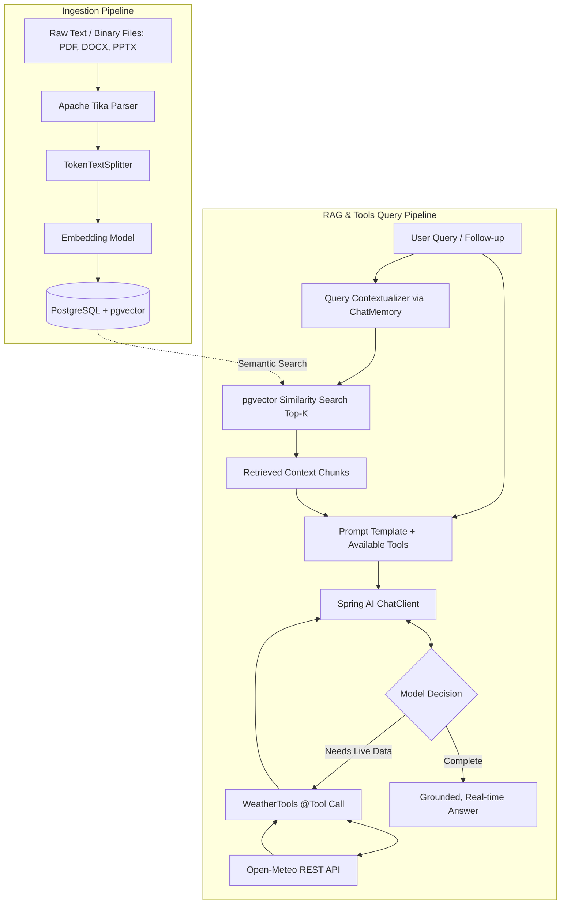

# 🧠 Java-RAG: AI Knowledge Assistant & Tool Platform

[](https://adoptium.net/)
[](https://spring.io/projects/spring-boot)
[](https://spring.io/projects/spring-ai)
[](https://github.com/pgvector/pgvector)
[](https://react.dev/)
[](https://www.docker.com/)

An enterprise-grade **Retrieval-Augmented Generation (RAG)** system, AI Knowledge Assistant, and **Function Calling / Tool Execution** platform built with **Java 21**, **Spring Boot**, and **Spring AI 2.0**, backed by **PostgreSQL & pgvector** for persistent vector storage and similarity search, accompanied by a responsive modern **Web UI**.

---

## 📑 Table of Contents

- [Overview & Architecture](#-overview--architecture)
- [Key Features](#-key-features)
- [Tech Stack](#-tech-stack)
- [Project Structure](#-project-structure)
- [Prerequisites](#-prerequisites)
- [Getting Started](#-getting-started)
  - [1. Backend Setup](#1-backend-setup)
  - [2. Frontend Setup](#2-frontend-setup)
- [API Reference & Examples](#-api-reference--examples)
  - [1. Ingest Documents (Text & Multi-Format Files)](#1-ingest-documents-text--multi-format-files)
  - [2. Multi-Turn RAG (Context + Conversational Memory)](#2-multi-turn-rag-context--conversational-memory)
  - [3. Function Calling / Tools (Live Weather)](#3-function-calling--tools-live-weather)
  - [4. Summarize Text (Structured Output)](#4-summarize-text-structured-output)
- [Postman Testing](#-postman-testing)
- [Roadmap](#-roadmap)

---

## 🏛️ Overview & Architecture

Standard LLMs suffer from hallucinations, static knowledge cutoffs, and inability to interact with real-time systems. This application solves these challenges by combining:
1. **RAG (Retrieval-Augmented Generation)**: Grounding answers in domain documents indexed in PostgreSQL `pgvector`.
2. **Multi-Turn Conversational Memory**: Preserving context across conversation turns with automatic query re-writing.
3. **Autonomous Function / Tool Calling**: Enabling the LLM to inspect live external APIs (like Open-Meteo Weather) dynamically via Spring AI 2.0 `@Tool` beans.



---

## ✨ Key Features

- **Multi-Format Ingestion with Apache Tika**: Ingest raw text, PDFs, Word documents (`.docx`), PowerPoint decks (`.pptx`), and plain text files directly into vector embeddings.
- **Vector Search with pgvector**: High-performance semantic cosine similarity search powered by PostgreSQL and pgvector.
- **Autonomous Tool Calling (Spring AI 2.0)**: Uses the modern `@Tool` and `@ToolParam` annotations to let the LLM invoke Java services and call live third-party REST APIs (e.g. Open-Meteo live weather) on demand.
- **Multi-Turn Contextual RAG**: Chat memory tracks previous conversation turns. Follow-up queries with pronouns (e.g., *"Who is she?"*, *"What did they build?"*) are automatically rewritten into standalone search queries before similarity search.
- **Structured JSON Responses**: Strongly typed entity generation (`SummaryResponse` with title, summary, and bulleted key points) using Java records.
- **Full-Featured Web UI**: A cyber-terminal themed React web application (`frontend/`) featuring live backend connectivity diagnostics, RAG assistant, file dropzone ingestion, chat playground, and summarizer.

---

## 🛠️ Tech Stack

| Domain | Technology | Purpose |
|---|---|---|
| **Backend** | **Java 21** | Modern LTS Java runtime |
| **Framework** | **Spring Boot 4.x** | Core microservice application framework |
| **AI Orchestration** | **Spring AI 2.0.x** | ChatClient, `@Tool` function calling, ChatMemory, DocumentReaders |
| **Vector Database** | **PostgreSQL 16 + pgvector** | Vector embedding storage & cosine similarity search |
| **Document Parsing**| **Apache Tika** | Universal parser for PDF, Word, PowerPoint, TXT |
| **Frontend** | **React 19 + Vite** | High-performance, responsive single-page application |
| **Styling** | **Vanilla CSS** | Custom Electric-Green terminal aesthetic & glassmorphism |
| **Containers** | **Docker Compose** | One-command PostgreSQL + pgvector provisioning |

---

## 📂 Project Structure

```text
aijavadevs/
├── .env.example                                  # Environment template
├── docker-compose.yml                            # PostgreSQL + pgvector service
├── AI_Knowledge_Assistant.postman_collection.json # Ready-to-import Postman suite
├── pom.xml                                       # Maven build configuration
├── frontend/                                     # React + Vite Web Application
│   ├── src/
│   │   ├── components/                           # RagAssistant, DocumentIngestion, ChatPlayground, etc.
│   │   ├── App.jsx                               # Top Command Bar, tabs, & health monitoring
│   │   └── index.css                             # Cyber-terminal design system
│   └── package.json
└── src/
    └── main/
        ├── java/dev/uday/aijavadevs/
        │   ├── AijavadevsApplication.java        # Spring Boot entry point & .env loader
        │   ├── chat/                             # Direct chat & structured summarizer
        │   │   ├── ChatController.java
        │   │   ├── ChatService.java
        │   │   ├── ChatRequest.java / ChatResponse.java
        │   │   └── SummaryRequest.java / SummaryResponse.java
        │   ├── config/                           # Vector store & memory beans
        │   │   └── VectorStoreConfig.java
        │   ├── document/                         # Multi-format document ingestion pipeline
        │   │   ├── DocumentController.java
        │   │   ├── DocumentService.java
        │   │   └── DocumentRequest.java / DocumentUploadResponse.java
        │   ├── rag/                              # Multi-turn conversational RAG orchestrator
        │   │   ├── RagController.java
        │   │   ├── RagService.java
        │   │   └── AskRequest.java / AskResponse.java
        │   └── weather/                          # Spring AI 2.0 Tool Calling Service
        │       └── WeatherTools.java             # @Tool methods calling Open-Meteo REST API
        └── resources/
            └── application.properties            # Database, port & Spring AI properties
```

---

## 📋 Prerequisites

- **Java 21** or higher (`java -version`)
- **Node.js 18+** & **npm** (for the frontend)
- **Docker** and **Docker Compose**
- **Maven** (or use the included `./mvnw`)
- An **OpenAI API Key** (or a local **Ollama** instance)

---

## 🚀 Getting Started

### 1. Backend Setup

#### A. Configure Environment Variables
Create `.env` in the root directory:
```bash
cp .env.example .env
```
Edit `.env` with your API key:
```properties
OPENAI_API_KEY=your_openai_api_key_here
OPENAI_BASE_URL=https://api.openai.com/v1
OPENAI_CHAT_MODEL=gpt-4o-mini
```

#### B. Start PostgreSQL with pgvector
```bash
docker compose up -d
```
*(Runs on port `5433` with database `ai_knowledge`, user `admin`, password `secret`)*.

#### C. Run the Spring Boot Application
```bash
# Linux/macOS
./mvnw clean spring-boot:run

# Windows PowerShell
.\mvnw.cmd clean spring-boot:run
```
The backend starts on **`http://localhost:8081`**.

---

### 2. Frontend Setup

In a separate terminal:
```bash
cd frontend
npm install
npm run dev
```
Open **`http://localhost:5173`** in your browser. The UI includes an automatic backend health check indicator and tabbed navigation.

---

## 📡 API Reference & Examples

### 1. Ingest Documents (Text & Multi-Format Files)

#### A. Raw Text Ingestion
- **Method**: `POST`
- **Endpoint**: `/api/ai/documents`
- **Body**:
```json
{
  "content": "Project Apollo is our internal cloud migration initiative scheduled for Q4 2026. The lead engineer is Sarah Jenkins, and the migration targets AWS EKS with multi-region failover."
}
```

#### B. File Upload (PDF, DOCX, PPTX, TXT)
- **Method**: `POST`
- **Endpoint**: `/api/ai/documents/upload`
- **Body**: `multipart/form-data` with key `file`
```bash
curl -X POST http://localhost:8081/api/ai/documents/upload \
  -F "file=@/path/to/architecture_spec.pdf"
```

---

### 2. Multi-Turn RAG (Context + Conversational Memory)

Query the knowledge assistant. Context is maintained across turns using `conversationId`.

- **Method**: `POST`
- **Endpoint**: `/api/ai/ask`

**Turn 1 Request:**
```json
{
  "question": "Who is leading Project Apollo and when is it scheduled?",
  "conversationId": "session-101"
}
```
**Turn 1 Response:**
```json
{
  "answer": "Project Apollo is scheduled for Q4 2026, and the lead engineer is Sarah Jenkins.",
  "conversationId": "session-101"
}
```

**Turn 2 (Follow-up with pronouns resolved via ChatMemory):**
```json
{
  "question": "What infrastructure target is she choosing?",
  "conversationId": "session-101"
}
```
**Turn 2 Response:**
```json
{
  "answer": "Sarah Jenkins is targeting AWS EKS with multi-region failover for Project Apollo.",
  "conversationId": "session-101"
}
```

**Clear Conversation Memory:**
```bash
curl -X DELETE http://localhost:8081/api/ai/ask/session-101
```

---

### 3. Function Calling / Tools (Live Weather)

Spring AI 2.0 tool execution via `WeatherTools`. When asking about current weather, the model automatically triggers the tool to call the Open-Meteo REST API:

- **Method**: `POST`
- **Endpoint**: `/api/ai/chat` (also supported in `/api/ai/ask`)

**Request:**
```json
{
  "message": "What is the current weather and temperature in Hyderabad?"
}
```

**Console Output:**
```text
🤖 [Tool Call] LLM requested weather for: Hyderabad
✅ [Tool Result] Weather fetched: 28.5°C, Mainly clear, partly cloudy, and overcast
```

**Response:**
```json
{
  "response": "The current weather in Hyderabad, India is 28.5°C with mainly clear to partly cloudy conditions."
}
```

---

### 4. Summarize Text (Structured Output)

Extracts structured JSON conforming to a Java record (`SummaryResponse`):

- **Method**: `POST`
- **Endpoint**: `/api/ai/summarize`

**Request:**
```json
{
  "text": "Spring Boot makes it easy to create stand-alone, production-grade Spring based Applications. We take an opinionated view of the Spring platform so you can get started with minimum fuss."
}
```

**Response:**
```json
{
  "title": "Introduction to Spring Boot",
  "summary": "Spring Boot simplifies creating production-ready applications with opinionated defaults and minimal configuration.",
  "keyPoints": [
    "Enables stand-alone application development",
    "Provides opinionated defaults for third-party libraries",
    "Minimizes boilerplate Spring configuration"
  ]
}
```

---

## 🧪 Postman Testing

A ready-to-run Postman collection is included in the project root:
- File: [`AI_Knowledge_Assistant.postman_collection.json`](AI_Knowledge_Assistant.postman_collection.json)

**How to test:**
1. Import `AI_Knowledge_Assistant.postman_collection.json` into Postman.
2. Ensure backend is running at `http://localhost:8081`.
3. Run the requests: Ingest Document $\rightarrow$ Multi-turn RAG $\rightarrow$ Live Weather Tool $\rightarrow$ Text Summarizer.

---

## 🗺️ Roadmap

- [x] **Vector Search**: PostgreSQL 16 + `pgvector` similarity store
- [x] **Multi-Format Ingestion**: PDF, DOCX, PPTX, and TXT parsing via Apache Tika
- [x] **Conversational Memory**: Multi-turn chat with `ChatMemory` and query contextualization
- [x] **Function Calling / Tools**: Spring AI 2.0 `@Tool` integration with live REST APIs
- [x] **Structured Outputs**: Type-safe entity extraction with Java records
- [x] **Interactive Web UI**: Responsive Cyber-Terminal UI built with React + Vite
- [ ] **Streaming API**: Server-Sent Events (SSE) `/api/ai/ask/stream` for real-time word streaming
- [ ] **Source Attribution**: Return matched source chunk metadata and similarity scores to the UI
- [ ] **OpenAPI / Swagger UI**: Interactive API documentation via `springdoc-openapi`
